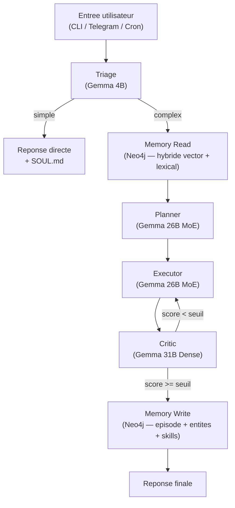
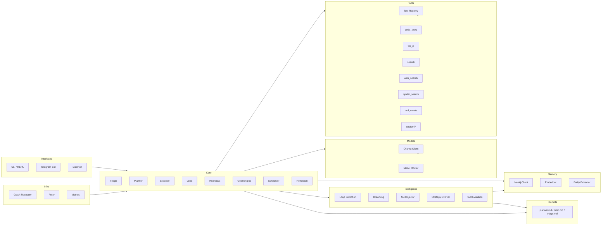

# Architecture de Crabot

> Vue d'ensemble de l'architecture technique de Crabot — agent IA 100% local.
> Pour la specification complete (contrats de code, prompts systeme, schemas de donnees), voir [`AGENT_PATTERN.md`](AGENT_PATTERN.md).

---

## Vue d'ensemble

Crabot est un agent autonome construit sur le pattern **Plan → Execute → Critique**. Chaque requete complexe passe par un pipeline en 6 etapes, avec des modeles specialises par role et une boucle de qualite automatique.



### Architecture des modules



---

## Pipeline de traitement

### 1. Triage

| | |
|---|---|
| **Role** | Classifier l'input en `simple` ou `complex` |
| **Modele** | Gemma 4B — thinking off, reponse < 1s |
| **Fichier** | `agent/core/triage.py` |
| **Entree** | Message utilisateur brut |
| **Sortie** | `simple` → reponse directe (E4B + SOUL.md) / `complex` → pipeline complet |

Les requetes simples (salutations, questions factuelles courtes) sont traitees directement sans mobiliser le pipeline complet — gain de latence et de ressources.

### 2. Memory Read

| | |
|---|---|
| **Role** | Enrichir le contexte avec la memoire episodique |
| **Composants** | Neo4j Client + Embedder |
| **Fichiers** | `agent/memory/neo4j_client.py`, `agent/memory/embedder.py` |
| **Strategie** | Recherche hybride : similarite vectorielle (70%) + matching lexical sur entites (30%) |
| **Parametres** | `context_k: 5` items, `read_threshold: 6.5`, embeddings `nomic-embed-text` (768 dim) |

Les skills apprises sont injectees via un cache TTL 5 min (`agent/intelligence/skill_injector.py`).

### 3. Planner

| | |
|---|---|
| **Role** | Produire un plan JSON structure avec etapes et outils |
| **Modele** | Gemma 26B MoE — thinking on, temperature 0.7 |
| **Fichier** | `agent/core/planner.py` |
| **Entree** | Message + contexte memoire + regles AGENTS.md + outils disponibles + skills |
| **Sortie** | `Plan` (goal + liste de `Step` + steps paralleles) — valide par Pydantic |

Le Planner recoit les regles operationnelles de `workspace/AGENTS.md` et la liste dynamique des outils (builtin + custom).

### 4. Executor

| | |
|---|---|
| **Role** | Executer chaque etape du plan, appeler les outils |
| **Modele** | Gemma 26B MoE — thinking off, temperature 1.0 |
| **Fichier** | `agent/core/executor.py` |
| **Entree** | `Plan` avec steps |
| **Sortie** | Liste de `StepResult` (output + tokens utilises) |

Fonctionnalites de l'Executor :
- **Execution parallele** via `asyncio.gather` pour les steps marques `parallel`
- **Skeleton-of-Thought** active quand l'output attendu depasse 500 tokens
- **Loop detection** (3 detecteurs) pour eviter les boucles infinies
- **Execution speculative** pour les inputs courts (< 200 tokens)

### 5. Critic

| | |
|---|---|
| **Role** | Evaluer la qualite de chaque sortie, decider des retries |
| **Modele** | Gemma 31B Dense — thinking on, temperature 0.3 |
| **Fichier** | `agent/core/critic.py` |
| **Entree** | `Step` + `StepResult` |
| **Sortie** | `CriticScore` (scores par axe, score final, decision retry, raison) |

Axes d'evaluation : **completeness**, **accuracy**, **format**, **coherence** — chacun note 0-10.
Score final 0-10 ; retry si < seuil adaptatif (defaut 6.5, max 3 retries).

### 6. Memory Write

| | |
|---|---|
| **Role** | Persister l'episode, les entites extraites et les skills apprises |
| **Composants** | Neo4j Client + Entity Extractor |
| **Fichiers** | `agent/memory/neo4j_client.py`, `agent/memory/entity_extractor.py` |
| **Seuil** | `write_threshold: 5.0` — seuls les episodes au-dessus sont sauvegardes |

Les transactions Neo4j sont atomiques. Les embeddings sont generes pour chaque episode sauvegarde.

---

## Modules

| Module | Repertoire | Fichiers | Responsabilite |
|--------|-----------|----------|----------------|
| **Core** | `agent/core/` | `triage.py`, `planner.py`, `executor.py`, `critic.py`, `heartbeat.py`, `goal_engine.py`, `scheduler.py`, `reflection.py`, `job_manager.py` | Pipeline principal + orchestration des taches proactives |
| **Models** | `agent/models/` | `ollama_client.py`, `router.py` | Client HTTP async vers Ollama (`/api/chat`) + routage multi-modele |
| **Tools** | `agent/tools/` | `base.py`, `registry.py`, `code_exec.py`, `file_io.py`, `search.py`, `web_search.py`, `spider_search.py`, `tool_create.py`, `custom/` | Registry factory + 6 outils builtin + outils custom auto-decouverts |
| **Prompts** | `agent/prompts/` | `triage.md`, `planner.md`, `critic.md` | Templates de prompts systeme externalises — modifiables par l'agent via evolution |
| **Memory** | `agent/memory/` | `neo4j_client.py`, `embedder.py`, `entity_extractor.py`, `schemas.cypher` | Graphe Neo4j (episodes, entites, skills) + embeddings + NER |
| **Intelligence** | `agent/intelligence/` | `loop_detection.py`, `dreaming.py`, `skill_injector.py`, `prompt_manager.py`, `action_applier.py`, `strategy_evolver.py`, `tool_evolution.py` | Autonomie : detection de boucles, consolidation memoire, evolution |
| **Personality** | `agent/personality/` | `loader.py` | Chargement des 5 fichiers `workspace/` Markdown |
| **Interfaces** | `agent/interfaces/` | `telegram_bot.py` | Bot Telegram (messages, callbacks, commandes) |
| **Infra** | `agent/infra/` | `state.py`, `retry.py`, `metrics.py` | Crash recovery, backoff exponentiel, metriques JSONL |

### Fichiers racine de l'agent

| Fichier | Role |
|---------|------|
| `agent/agent.py` | Orchestrateur principal — coordonne le pipeline complet |
| `agent/schemas.py` | Modeles Pydantic partages (Plan, Step, CriticScore, etc.) |
| `agent/config.py` | Chargement de `config.yaml` + variables d'environnement |
| `agent/config.yaml` | Configuration centralisee (modeles, sampling, seuils, memoire, etc.) |
| `agent/daemon.py` | Mode daemon : Telegram + scheduler + heartbeat |
| `agent/__main__.py` | Point d'entree CLI (REPL, one-shot, daemon) |

---

## Systeme de personnalite

Crabot a une personnalite configurable via 5 fichiers Markdown dans `workspace/`. Ils sont charges par `agent/personality/loader.py` et injectes dans les prompts systeme des composants concernes.

| Fichier | Ce qu'il controle | Injecte dans |
|---------|-------------------|-------------|
| `SOUL.md` | Ton, opinions, humour, limites ethiques, style de reponse | Executor |
| `IDENTITY.md` | Nom, emoji, creature, vibe, theme visuel | Telegram Bot |
| `AGENTS.md` | Regles operationnelles, contraintes de securite, politiques outils | Planner |
| `USER.md` | Profil utilisateur, preferences, expertise, langue | Executor |
| `HEARTBEAT.md` | Taches proactives (cron), consignes pour le daemon | Daemon / Heartbeat |

Pour changer le comportement de l'agent, il suffit d'editer ces fichiers et de relancer.

---

## Routage multi-modele

Crabot utilise une strategie de routage qui assigne le modele optimal a chaque etape du pipeline.

### Modeles Gemma 4

| Variante | Parametres | Params actifs | Contexte | RAM (Q4) | Role dans Crabot |
|----------|-----------|---------------|----------|----------|------------------|
| **Gemma 4B** | 4B | 4B | 32K | ~3 Go | Triage — classification ultra-rapide |
| **Gemma 26B MoE** | 26B | ~8B actifs | 128K | ~18 Go | Planner + Executor — backbone principal |
| **Gemma 31B Dense** | 31B | 31B | 128K | ~20 Go | Critic — evaluation rigoureuse |

### Contrainte RAM

Sur Apple Silicon M4 Pro (48 Go), seuls 2 modeles tiennent en memoire simultanement. Ollama gere le swap automatique (~5s de penalite). La strategie : garder le 26B MoE resident, charger le 31B uniquement pour les passes Critic.

### Configuration par role

| Role | Modele | Thinking | Temperature | top_p | top_k |
|------|--------|----------|-------------|-------|-------|
| Triage | 4B | off | 1.0 | 0.95 | 64 |
| Planner | 26B MoE | on | 0.7 | 0.95 | 64 |
| Executor | 26B MoE | off | 1.0 | 0.95 | 64 |
| Critic | 31B Dense | on | 0.3 | 0.9 | 32 |

Le thinking mode (`<|think|>`) est active pour le Planner et le Critic (raisonnement explicite), desactive pour le Triage et l'Executor (rapidite).

---

## Fonctionnalites

### Pipeline agentique

- [x] Pattern Plan → Execute → Critique avec retry automatique
- [x] Triage simple/complex (bypass du pipeline pour les requetes simples)
- [x] Execution parallele des steps (`asyncio.gather`)
- [x] Skeleton-of-Thought pour les outputs longs (> 500 tokens)
- [x] Execution speculative pour les inputs courts (< 200 tokens)
- [x] Validation Pydantic stricte des plans et resultats

### Memoire & connaissances

- [x] Neo4j graph persistant (episodes, entites, skills)
- [x] Recherche hybride (vector 70% + lexical 30%)
- [x] Embeddings `nomic-embed-text` (768 dimensions)
- [x] Extraction d'entites via LLM (NER)
- [x] Seuils adaptatifs lecture/ecriture (read: 6.5, write: 5.0)
- [x] Index vectoriel Neo4j pour recherche semantique

### Intelligence autonome

- [x] Dreaming — consolidation memorielle bio-inspiree (frequence, pertinence, diversite, recence)
- [x] Loop detection — 3 detecteurs (repeat, circuit-breaker, ping-pong)
- [x] Seuil de qualite adaptatif (calibre sur la distribution des scores passes)
- [x] Reflection — auto-analyse des metriques avec ajustement des parametres (desactive par defaut)
- [x] Strategy evolution — mutation de prompts et configuration (evolution active par defaut)
- [x] Auto-modification autonome — l'agent modifie ses propres fichiers source (prompts, tools, config)
- [x] Tool evolution — amelioration des outils via feedback
- [x] Skill injection — injection des skills apprises dans le contexte Planner

### Outils

- [x] `code` — Execution Python en subprocess sandbox (timeout + isolation)
- [x] `file` — Lecture/ecriture de fichiers (chemins restreints)
- [x] `search` — Recherche dans les fichiers locaux
- [x] `web_search` — Brave Search API
- [x] `spider_search` — Spider Cloud API
- [x] `tool_create` — Meta-outil : l'agent cree ses propres outils a la volee
- [x] Auto-discovery des outils custom au demarrage (`agent/tools/custom/`)
- [x] Factory pattern : ajout d'outils sans toucher a l'orchestrateur

### Resilience

- [x] Crash recovery — cursor persistence avec ecriture atomique (.tmp + rename)
- [x] Retry avec backoff exponentiel et jitter
- [x] Metriques JSONL pour tracing et debug
- [x] Transactions Neo4j atomiques

### Interfaces & autonomie

- [x] CLI REPL interactif (`make chat`)
- [x] Mode one-shot (`make run PROMPT="..."`)
- [x] Mode daemon Telegram 24/7 (`make daemon`)
- [x] Heartbeat — taches proactives toutes les 30 min
- [x] Goal engine — suivi d'objectifs long terme (tick toutes les 15 min)
- [x] Self-scheduling — l'agent planifie ses propres taches cron
- [x] Job manager — orchestration async des requetes concurrentes
- [x] Feedback utilisateur (`/good`, `/bad`) avec impact sur les scores

---

## Patterns de conception

### Plan → Execute → Critique

Scaffold fort qui compense les limites d'un modele local. Le Planner structure la reflexion, l'Executor agit, le Critic verifie. La boucle de retry garantit un seuil de qualite minimum avant toute reponse complexe.

### Factory Pattern (Tool Registry)

`agent/tools/registry.py` decouvre et enregistre les outils automatiquement. Chaque outil herite de `Tool` (`agent/tools/base.py`) et s'auto-enregistre. Les outils custom dans `agent/tools/custom/` sont detectes au demarrage — zero couplage avec l'orchestrateur.

### Multi-model Routing

`agent/models/router.py` selectionne le modele optimal (4B / 26B / 31B) selon le role demande. Le routage est conscient de la contrainte RAM et minimise les swaps de modeles couteux.

### Recherche hybride

Combinaison ponderee de similarite vectorielle (embeddings `nomic-embed-text`) et matching lexical sur les entites. Le poids est configurable (`vector_weight: 0.7`, `lexical_weight: 0.3`). Permet de retrouver le contexte pertinent meme avec des reformulations.

### Skeleton-of-Thought

Pour les outputs longs (> 500 tokens), le modele genere d'abord un squelette (plan de la reponse) puis remplit chaque section. Ameliore la coherence et la structure des reponses longues.

### Dreaming (consolidation bio-inspiree)

`agent/intelligence/dreaming.py` consolide periodiquement la memoire selon 4 criteres : frequence d'acces, pertinence (score), diversite et recence. Les episodes a faible score sont comprimes ou purges, les patterns importants sont renforces.

### Seuil adaptatif

Le seuil de qualite du Critic (`min_score`) s'ajuste automatiquement via `mean_minus_std` sur la distribution des scores passes (minimum 20 echantillons). Plus Crabot s'ameliore, plus il est exigeant.

### Cursor Recovery

`agent/infra/state.py` persiste la progression des steps en cours. Ecriture atomique (fichier .tmp + rename) pour survivre aux crashes. Au redemarrage, le pipeline reprend la ou il s'etait arrete.

### Strategy Evolution

`agent/intelligence/strategy_evolver.py` analyse les traces du pipeline pour detecter les inefficacites et proposer des mutations (ajustement de seuils, escalade de modele, mutation de prompts). Les mutations sont loguees et reversibles.

---

## Modeles de donnees

### Schemas Pydantic (`agent/schemas.py`)

```
Plan
├── goal: str
├── steps: list[Step]
│   ├── id: int
│   ├── tool: str
│   ├── input: str
│   └── expected_output: str
└── parallel: list[int]

StepResult
├── step_id: int
├── output: str
└── tokens_used: int

CriticScore
├── scores: dict[str, float]  (completeness, accuracy, format, coherence)
├── final_score: float  (0-10)
├── retry: bool
└── reason: str

ScoredResult
├── step: Step
├── result: StepResult
└── score: CriticScore

AgentResult
├── goal: str
└── results: list[ScoredResult]

Mutation
├── id: str
├── action_type: str  (adjust_threshold | escalate_model | disable_tool | create_skill | modify_source)
├── target: str
├── previous_value / new_value: Any
├── reason: str
└── rolled_back: bool
```

### Graphe Neo4j (`agent/memory/schemas.cypher`)

```
(:Episode) — conversation complete avec embedding vectoriel
    │
    ├──[:MENTIONS]──▶ (:Entity) — entite nommee extraite (personne, outil, concept)
    │
    └──[:USED_SKILL]──▶ (:Skill) — pattern reutilisable appris
```

Index vectoriel sur les embeddings Episode (768 dimensions, similarite cosinus).

---

## Configuration

Toute la configuration est centralisee dans `agent/config.yaml`. Les secrets sont dans `.env`.

| Section | Description |
|---------|-------------|
| `models` | URL Ollama, noms des modeles par role |
| `sampling` | Temperature, top_p, top_k par role (default, planner, critic) |
| `thinking` | Activation du mode `<\|think\|>` par composant |
| `thresholds` | Score minimum (6.5), max retries (3), execution parallele |
| `skeleton` | Skeleton-of-Thought (seuil 500 tokens) |
| `speculative` | Execution speculative (seuil 200 tokens input) |
| `vision` | Budgets tokens pour OCR et analyse d'images |
| `recovery` | Cursor persistence et ecriture atomique |
| `memory` | Neo4j (URI, seuils, poids hybride, modele embedding) |
| `context` | Max tokens par appel, trace en contexte |
| `telegram` | Token bot, whitelist utilisateurs |
| `daemon` | Concurrence max (3), timeout (300s) |
| `logging` | Niveau + fichier trace JSONL |
| `scheduler` | Taches cron, watch paths, self-scheduling |
| `feedback` | Scoring utilisateur (good: 9.0, bad: 2.0) |
| `adaptive` | Calibrage auto du seuil (methode, min samples) |
| `reflection` | Analyse des N derniers episodes |
| `evolution` | Auto-modification activee, mutations max par cycle, roles proteges, fichiers proteges |

---

> Pour la specification technique complete (contrats de code, prompts systeme, schemas detailles), voir [`AGENT_PATTERN.md`](AGENT_PATTERN.md).
